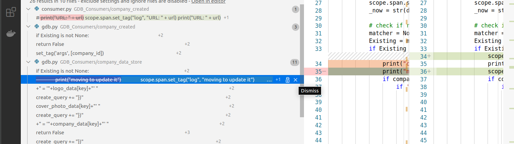

# Implementing Jaeger Tracing
***
## Adding Service Name
```python
service_name = "ShortlistCadidatesForJobAPI"
```
**Files to exclude**
`Api.py, jaegerTracing.py, registrator.py`

***
## Importing Libraries

### Flask API Tracing
#### Automated Traces All Routes
```python
# Distributed Tracing
import jaegerTracing
tracer = jaegerTracing.getTracerInstance()
from flask_opentracing import FlaskTracing
tracing = FlaskTracing(tracer, True, app)
```
#### Import Libraries via Regrx
**Regex Pattern**
```
cors = CORS\(app, resources=\{r"/\*": \{"origins": "\*"\}\}\)
```
**Regex Pattern**
```
cors = CORS(app, resources={r"/*": {"origins": "*"}})

# Distributed Tracing
import jaegerTracing
tracer = jaegerTracing.getTracerInstance()
from flask_opentracing import FlaskTracing
tracing = FlaskTracing(tracer, True, app)
```

***
### Batch Editing in Client files
#### Import Libraries without Regex
```python
# Distributed Tracing
from opentracing_instrumentation.request_context import get_current_span, span_in_context
import jaegerTracing
tracer = jaegerTracing.getTracerInstance()
from opentracing.propagation import Format
```
#### Import Libraries via Regrx
**Regex Pattern**
```
class\s\w*\(\):
```
**Regex Pattern**
```
# Distributed Tracing
from opentracing_instrumentation.request_context import get_current_span, span_in_context
import jaegerTracing
tracer = jaegerTracing.getTracerInstance()
from opentracing.propagation import Format
 
$0
```
***
## Injecting Spans

### Methods with try-except (Without Class)

!!! Caution
    When you put the following opentracing implementaion the code mush below should reindent towards right by 4 space (1 Tab).

!!! hint 
    Add jaeger imports -- to the files with no class


**Regex Pattern**
```
\n(def\s([\w]+)\s?\(self,*\s*([\w,\s=']*)\)\s*:)\s*
    (try:)
```
**Regex Pattern**
```
$1
    $4
        span_ctx = tracer.extract(format=Format.TEXT_MAP, carrier={})
        with tracer.start_active_span('$2', child_of=span_ctx) as scope:
            scope.span.set_tag('args', [$3])
```
### Methods without try-except
**Regex Pattern**
```
\n(def\s([\w]+)\s?\(self,*\s*([\w,\s=']*)\)\s*:)
```
**Regex Pattern**
```

$1
    span_ctx = tracer.extract(format=Format.TEXT_MAP, carrier={})
    with tracer.start_active_span('$2', child_of=span_ctx) as scope:
        scope.span.set_tag('args', [$3])
```


*******************************************************************************************************
### Methods with try-except


**Regex Pattern**
```
(    )(def\s([\w]+)\s?\(self,*\s*([\w,\s=']*)\)\s*:)\s*
        (try:)
```
**Regex Pattern**
```
$2
    $5
        span_ctx = tracer.extract(format=Format.TEXT_MAP, carrier={})
        with tracer.start_active_span('$3', child_of=span_ctx) as scope:
            scope.span.set_tag('args', [$4])
```
### Methods without try-except
**Regex Pattern**
```
(    )(def\s([\w]+)\s?\(self,*\s*([\w,\s=']*)\)\s*:)
```
**Regex Pattern**
```
$2
    span_ctx = tracer.extract(format=Format.TEXT_MAP, carrier={})
    with tracer.start_active_span('$3', child_of=span_ctx) as scope:
        scope.span.set_tag('args', [$4])
```

!!! Caution
    Indentation of the file reduces the starting spaces upto 4 spaces with cause `except` to deviate from consective `try`. You should have to replace the spaces accouding to the starting try block.

### Handling Exception
**Regex Pattern**
```
(\s*)except Exception as ex:
```
**Regex Pattern**
```
$0
    $1scope.span.set_tag('Exception', ex)
```

### Handling Return Statuses

!!! Tip
    Make sure `regex` button is pressed in vscode search field.

#### 01 - Return `Variable Names`
**Regex Pattern**
```
(\s*)return jsonify\(([\w]*)\)
```

**Regex Pattern**
```
$1scope.span.set_tag('response', $2)$0
```

#### 02 - Return `Strings`

> JSON String

**Regex Pattern**
```
(\s*)return jsonify\("([\w\s]*)"\)
```
**Regex Pattern**
```
$1scope.span.set_tag('response', '$2')$0
```
> Simple String

**Regex Pattern**
```
(\s*)return\s*["']([\w\s]*)['"]
```
**Regex Pattern**
```
$1scope.span.set_tag('response', "$2")$0
```


#### 03 - Return `Json Data`
**Regex Pattern** 
```
(\s*)return jsonify\(\{(['\w:,\s\[\].+"\(\)]*)\}\)
```
**Regex Pattern**
```
$1scope.span.set_tag('response', dict({$2}))$0
```
#### 04 - Return `Graph Database Collections Query`
**Regex Pattern** 
```
(\s*)return list\(self\.Collection\.find\((\w*)
```
**Regex Pattern**
```
$1scope.span.set_tag('response', $2)$0
```

!!! hint
    add the following snippet

```
self.graph.run 
```
#### 05 - Return `response.json()`
**Regex Pattern**
```
(\s*)return response\.json\(\)
```
**Regex Pattern**
```
$1scope.span.set_tag('response', response.json())
$0
```

#### 06 - Return True/False
**Regex Pattern**
```
(\s*)return True
```
```
$1scope.span.set_tag('response',  'True')
$0
```

**Regex Pattern**
```
(\s*)return False
```
```
$1scope.span.set_tag('response',  'False')
$0
```

#### 07 - Adding Print logging to jaeger
**Regex Pattern**
```
([\s]*)print\((["'][\w\s:."]*[+\sstr\(\w\)]*)\)\n
```
```
$1scope.span.set_tag("log", $2)$0
```



***
## Keywords Used in All APIS

`args`
`response`
`query`
`log`


***
## RPC Inject/Extract Calls Regex


#### Injecting Spans Replacement

!!! hint
    Do not include url with KONG calling

**Regex Pattern**
```
([\s]*)response\s*=\s*requests.
```
**Regex Pattern**
```
$1#Distributed Tracing
$1carrier = {"Content-Type": "application/json"}
$1tracer.inject(
$1    span_context=scope.span.context,
$1    format=Format.TEXT_MAP,
$1    carrier=carrier)
$0
```


**Regex Pattern**
```
headers\s*=\s*\{([\w\s" '-:]*)\}
```
**Regex Pattern**
```
headers= carrier
```


#### Extracting Spans Replacement

!!! hint
    This portion is already implemented while injecting spans

**Regex Pattern**
```
([\s]*)with tracer.start_active_span
```
**Regex Pattern**
```
$1span_ctx = tracer.extract(format=Format.TEXT_MAP, carrier={})
$0
```

**Regex Pattern**
```
) as scope:
```
**Regex Pattern**
```
, child_of=span_ctx) as scope:
```
***


!!! hint
    Please reindent all the files where you have done changes -- feel free to use the following snippet to searching out the files will require reindentation.

!!! Tip
    After applying regex, methods were reindented from their actual location, you have to manually indent the methods. ++ctrl+close-bracket++

**Regex Pattern**
```
class\s\w*\(\):
```


***
## Branches Created for Tracing
### Names of Branches
```
git branch
```

- **✔Tracing--RemaingAPIs-2✔**
    - Social
        - company_activity_api                       
        - company_activity_apis
        - connection
        - follow_company
        - follow_user
        - job_post
        - news_feed
        - suggested_friends
        - url_post
        - user_comment_on_post_web_notifications
        - user_like_post_web_notifications
        - user_notifications
        - user_share_post_web_notifications

- **✔Tracing--RemaingAPIs-1✔**
    - profile_and_job_post_comparison_ratio_api
    - post_seen_api
    - Jobs_RelatedTo_Skills_Experience
    - profile_seen_api

- **✔Tracing-GDB_APIs✔**
    - GDB_APIs
        - Activity
        - EmailLogs
        - NewsFeed

- **✔tracing_chat_api,-default-hiring--timeslot,-emailapi✔**
    - ChatAPI
    - default_hiring_procedure_for_company
    - default_time_slot_for_company
    - email_api


- **✔Tracing-GDB_Consumers✔**
    - company_bookmarks_candidate 
    - company_created
    - company_created_job_post               
    - company_created_url_post
    - company_data_stor
    - company_seen_user_profile
    - company_shared_url
    - employee_associated_with_company
    - GDB_Newsfeed
    - job_application_state_chagne_notice
    - job_application_state_email_store_to_gdb
    - social_connect_users
    - social_disconnect_users
    - user_bookmarks_job_post
    - user_created
    - user_created_url_post
    - user_follow_company
    - user_job_post_like
    - user_job_post_unlike
    - user_seen_job_post
    - user_seen_user_profile
    - user_shared_job_post
    - user_shared_url_post
    - user_url_post_like
    - user_url_post_unlike

- **Tracing_skill_social**
    - Skill_Social/endorse_skill_api
    - Skill_Social/rate_skill_api
    - Skill_Social/skill_comment_api

- **Tracing_jobAPIs(all)**
    - ✔ job_application_state_change_notice ✔
    - ✔ job_application_state_change_save ✔
    - ✔ job_application_state_change_web_notification ✔
    - ✔ job_application_state_email_log_to_mdb ✔
    - ✔ job_application_state_management_api ✔
    - ✔ job_comments_api ✔
- **Tracing-bkmrk-candid,-candid-job-app-mgmt-api,-bkmrk-job-api**
    - ✔bookmark_candidates_api✔
    - ✔candidate_job_application_management_api✔
    - ✔bookmark_job_api✔
- **Tracing-JobPost-API**
    - revamp_laravel_to_python_apis
        - jobpost_python_apis
- **shortlistedCandidate_tracing_with_Jaeger** 
    - ✔ shortlist_candidates_api ✔
    - revamp_laravel_to_python_apis
        - ✔ admin_operation_python_apis ✔         
        - ✔ Consumer_UserName_Image_Storage ✔
        - ✔ profile_python_apis ✔
        - ✔ registeration_python_service_apis 
- **jeager_implementation_organizationalDataAPI**
    - organizational_data

<!-- 

regex

(http://[\w./-:'+\s-]*) -->


