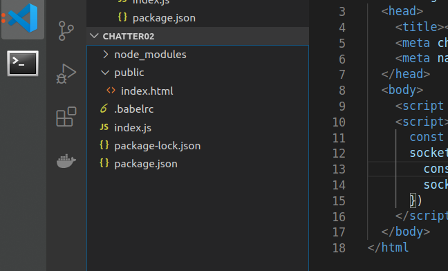

# [Socket.io](https://socket.io/docs/) 

Socket.IO is JavaScript implementation to work with HTML 5 WebSockets. In can be used in NodeJS & based server frameworks for server-side, while client-side can be integrated with pure JavaScript, AngularJS, React.

Socket.IO proves to be promising with over 49K [GitHub Stars](https://github.com/socketio/socket.io). Furthermore it’s stable for production level with V2.0.0 being released in 2017.


> Quick links Documentation

- [Server-api](https://socket.io/docs/server-api/)
- [Client-api](https://socket.io/docs/client-api/)


**NPM Version**
```bash
npm -v
```

**Node Version**
```bash
node -v
```
## 0 Installing Packages

```bash
npm init
```


**Installing Packages**
```bash
npm i --save express nodemon socket.io
```

???+ info "What is `Express`"
    Express.js, or simply Express, is a web application framework for Node.js, released as free and open-source software under the MIT License. It is designed for building web applications and APIs. It has been called the de facto standard server framework for Node.js. [en.wikipedia.org](https://en.wikipedia.org/wiki/Express.js)

??? info "What is `Nodemon`"
    Nodemon is a development dependency that monitors for any changes in your Node. js application and automatically restarts the server, saving time and tedious work.  [medium.com](https://medium.com/@jeffrey.allen.lewis/how-to-increase-development-efficiency-with-nodemon-and-opn-4027b96175a1)

??? info "What is `Socket.io`"
    Socket.IO is JavaScript implementation to work with HTML 5 WebSockets. In can be used in NodeJS & based server frameworks for server-side, while client-side can be integrated with pure JavaScript, AngularJS, React.[Socket.io](https://socket.io/docs/) 

```bash
npm i --save-dev babel-cli babel-preset-env babel-preset-stage-0
```

In `package.json` file add these lines in the script keyword
```json
// package.json
"scripts": {
    "start": "nodemon ./index.js --exec babel-node -e js",
    "test": "DEBUG=* npm run nodemon ./index.js --exec babel-node -e js"
  },
```

Create a new file `.babelrc` with the same directory of `package.json` file.  


!!! hint

    Insert the following snippet into the newly created file.
    ```json
    {
        "presets": [
            "env",
            "stage-0"
        ]
    }
    ```


!!! hint
    Babel is used to compile the project

## 1 Simple chat app
Create a file `index.js` on the same level of node_modules directory and paste the following snipet into it.


> [index.js](scripts/socketio/socketServer/index.js)

```javascript
{!scripts/socketio/socketServer/index.js!}
```




Now create a directory `public` on the same level of node_modules directory.

Create a file `index.html` and paste the below snippet into it.

> [index.html](scripts/socketio/socketServer/public/index.html)

```javascript
{!scripts/socketio/socketServer/public/index.html!}
```

```bash
node run start
```

??? error "[nodemon] app crashed - waiting for file changes before starting..."
    Node.JS: Getting error : [nodemon] Internal watch failed: watch ENOSPC

    ```
    events.js:183
      throw er; // Unhandled 'error' event
      ^

    Error: listen EADDRINUSE :::3000
        at Object._errnoException (util.js:1022:11)
        at _exceptionWithHostPort (util.js:1044:20)
        at Server.setupListenHandle [as _listen2] (net.js:1367:14)
        at listenInCluster (net.js:1408:12)
        at Server.listen (net.js:1492:7)
        at Object.<anonymous> (/home/mohsin/Desktop/chatter02/index.js:6:8)
        at Module._compile (module.js:652:30)
        at loader (/home/mohsin/Desktop/chatter02/node_modules/babel-register/lib/node.js:144:5)
        at Object.require.extensions.(anonymous function) [as .js] (/home/mohsin/Desktop/chatter02/node_modules/babel-register/lib/node.js:154:7)
        at Module.load (module.js:565:32)
    [nodemon] app crashed - waiting for file changes before starting...
    ```

!!!success ""
    Solution to this problem is in the following snippet

    ```bash
    echo fs.inotify.max_user_watches=524288 | sudo tee -a /etc/sysctl.conf && sudo sysctl -p
    ```

    or

    **There is a server that's already running, so you cannot start another server.**

    


**Now, with Bootstrap**

> [index.js](scripts/socketio/withbootstrap/index.js)

```javascript
{!scripts/socketio/withbootstrap/index.js!}
```

and the `index.html` (client) should look like this —

> [index.html](scripts/socketio/withbootstrap/public/index.html)

```javascript
{!scripts/socketio/withbootstrap/public/index.html!}
```

## 2 **Connect / Disconnect Events** 

> [index.js](scripts/socketio/connectDisconnect/index.js)

```javascript hl_lines="14 21"
{!scripts/socketio/connectDisconnect/index.js!}
```

and the `index.html` (client) should look like this —

> [index.html](scripts/socketio/connectDisconnect/public/index.html)

```javascript hl_lines="45"
{!scripts/socketio/connectDisconnect/public/index.html!}
```


## 3 **NameSpace Setup**

Now, we are going to add a namespace   `tech` to our server.

> [index.js](scripts/socketio/namespace/index.js)

```javascript hl_lines="15"
{!scripts/socketio/namespace/index.js!}
```

and the `index.html` (client) should look like this —

> [index.html](scripts/socketio/namespace/public/index.html)

```javascript hl_lines="38"
{!scripts/socketio/namespace/public/index.html!}
```


## 4 Setting up Rooms

**Init Room Javascript**

> [index.js](scripts/socketio/room01/index.js)

```javascript hl_lines="18 19 20 23 24 25"
{!scripts/socketio/room01/index.js!}
```

and the `index.html` (client) should look like this —

> [index.html](scripts/socketio/room01/public/index.html)

```javascript hl_lines="38 42 49"
{!scripts/socketio/room01/public/index.html!}
```


**JavaScript Room with seperate base file **

> [index.js](scripts/socketio/room02/index.js)

```javascript
{!scripts/socketio/room02/index.js!}
```

and the `index.html` (client) should look like this —

> [index.html](scripts/socketio/room02/public/index.html)

```javascript hl_lines="19 20 21"
{!scripts/socketio/room02/public/index.html!}
```

> [javascript.html](scripts/socketio/room02/public/javascript.html)

```javascript
{!scripts/socketio/room02/public/javascript.html!}
```


## 5 **Complete tech rooms**

> [index.js](scripts/socketio/room03/index.js)

```javascript
{!scripts/socketio/room03/index.js!}
```

and the `index.html` (client) should look like this —

> [index.html](scripts/socketio/room03/public/index.html)

```javascript
{!scripts/socketio/room03/public/index.html!}
```

``` javascript  tab="javascript.html" hl_lines="38 4" 

{!scripts/socketio/room03/public/javascript.html!}

```

``` javascript tab="swift.html" hl_lines="38 4" 

{!scripts/socketio/room03/public/swift.html!}

```

``` javascript tab="css.html" hl_lines="38 4" 

{!scripts/socketio/room03/public/css.html!}

```

## 6 Debug Tool


**Manually**


> For Linux

```
DEBUG=* npm run start
```
> For Windows

```
set DEBUG=* & npm run start
```

**Automatically**

``` json hl_lines="8" 

{!scripts/socketio/debug/package.json!}

```


```bash
npm run test

```


